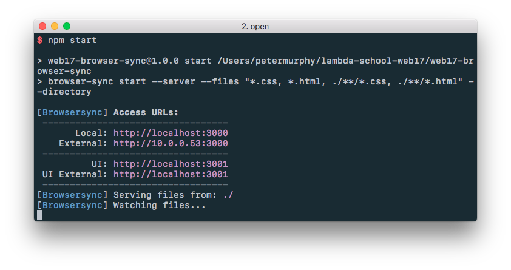

# Example use of `browser-sync`

Copy the `package.json` file into the root directory of your Lambda School projects (assuming you have all your LS projects in one directory). Then run

```bash
$ npm i
```

You can start up a server with

```bash
$ npm start
```

This will give you a live server that hot-reloads any time an `html` or `css` file is saved in any of the subdirectories.




Now you can navigate to `http://10.0.0.53:3000` (or whatever is displayed) to see your project. This address should also be accessible to any device on the same network, so you can see live reloads on your phone/tablet/desktop/laptop.

Check out `browser-sync` for more info: https://www.browsersync.io.
